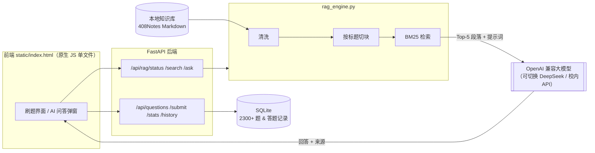
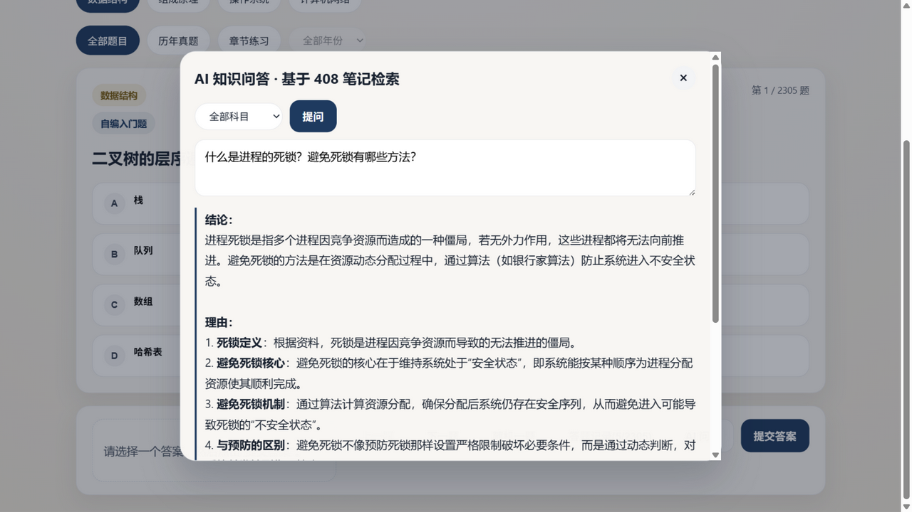
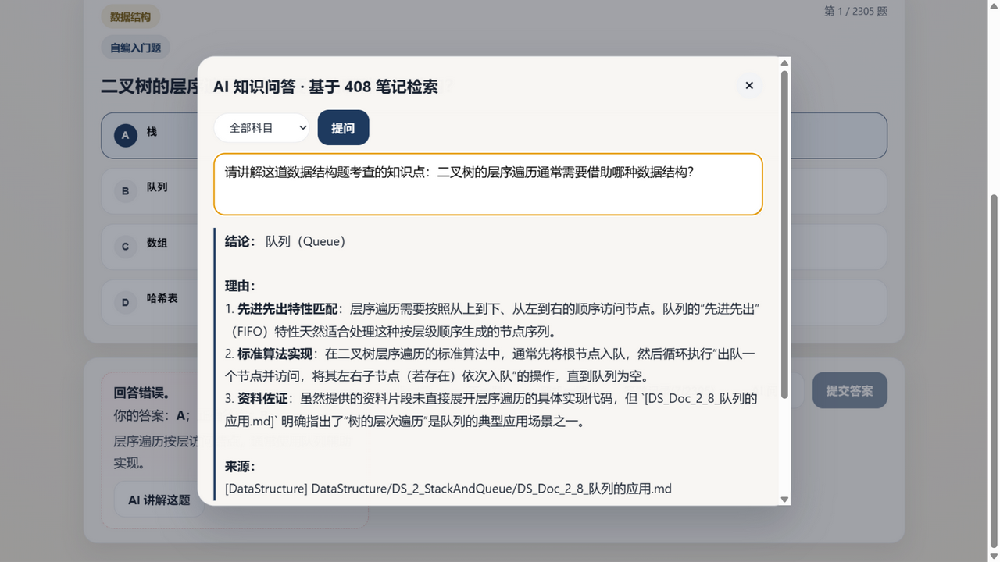

# StudyMate AI · 408 刷题 + 知识库问答

考研 408 一体化复习工具：**刷题**与**AI 知识问答**闭环——按科目/年份刷 2300+ 道选择题（含 2009-2025 全部统考真题），遇到不懂的知识点直接向 AI 提问，回答基于本地知识库检索生成、附带参考来源，可溯源、不瞎编。

## 功能特性

| 功能 | 说明 |
|------|------|
| 题库刷题 | 2300+ 道选择题：660 道历年统考真题（2009-2025）+ 王道章节题 + 自编入门题；按科目、真题/章节、年份三维筛选，每题标注来源 |
| AI 知识问答（RAG） | 提问 408 知识点 → BM25 检索本地笔记语料 → 大模型基于资料作答 → 列出参考来源 |
| 错题 AI 讲解 | 判分后一键把题目交给 RAG，结合知识库讲解考查的知识点 |
| 学习记录 | 答题统计、正确率、答题历史、单题计时器 |

## 架构



## 技术要点

- **手写 BM25 检索**：中文按二元词（bigram）切分，TF 饱和 + 文档长度归一化打分，零外部检索库依赖，语料加载后全内存检索
- **防幻觉设计**：系统提示词强制"只能依据给定资料回答，资料不足必须明说"；模型返回的同时附带命中的原文来源列表
- **可切换生成端**：走 OpenAI 兼容协议，改环境变量即可在 DeepSeek / 校内大模型服务之间切换；未配置时接口诚实回退为"仅返回检索结果"
- **数据管线可复现**：`tools/import_questions.py` 从开源题库清洗导入（指纹去重、自动备份、导入报告），第三方数据仅存本地不入仓库
- 轻后端：FastAPI + SQLite，无 ORM、无重型依赖；前端无构建链

## 快速开始

```bash
pip install -r requirements.txt
python backend.py            # 打开 http://127.0.0.1:8000
```

- 首次运行自动建库并导入种子题；导入完整题库（2300+ 题）：

```bash
mkdir -p tools/vendor
curl -L -o tools/vendor/408-data.json \
  https://raw.githubusercontent.com/lij768423-svg/408-/main/data.json
python tools/import_questions.py
```

- 启用 AI 问答生成（可选，不配则问答接口返回检索结果）：

```bash
cp .env.example .env   # 填入任意 OpenAI 兼容服务的 key / base / model
```

## 演示截图

| AI 知识问答（附来源） | 错题 AI 讲解 |
|---|---|
|  |  |

## 数据来源

- 题库：[lij768423-svg/408-](https://github.com/lij768423-svg/408-)（ISC License），经脚本清洗导入本地 SQLite，题目数据不入本仓库
- 知识库语料：[CodePanda66/CSPostgraduate-408](https://github.com/CodePanda66/CSPostgraduate-408) 的 408Notes（仅入库语料部分）

## Roadmap

- [ ] BM25 → 向量检索升级（Embedding + ANN 索引）
- [ ] 多选题与图形题支持
- [ ] Serverless 部署（题库构建期导入 + 云端生成端）
